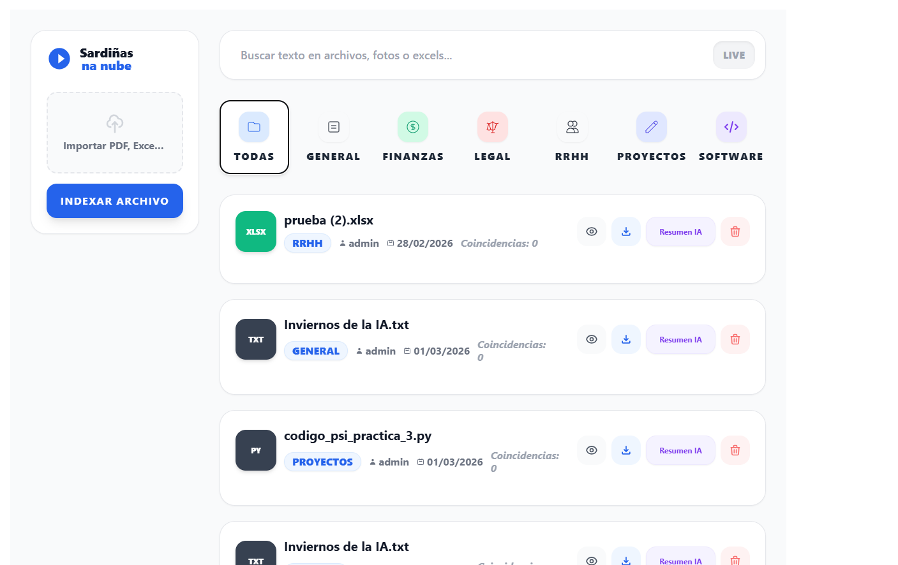

# 🐟 Sardinas na Nube

> Gestor documental inteligente con IA — tu nube privada que **entiende** lo que guardas.

---

## ✨ Descripción general

**Sardinas na Nube** es una plataforma web de gestión documental inteligente orientada a empresas y equipos. No solo almacena archivos: los **lee, clasifica, busca semánticamente y resume automáticamente usando modelos de lenguaje grandes**.

---

## 🧠 Capacidades principales

* Subida de documentos (PDF, Word, Excel...)
* Extracción automática de texto
* Clasificación automática por categoría usando IA
* Búsqueda interna inteligente (no solo por nombre)
* Resumen automático corporativo
* Visualización rápida de contenido relevante

---

## 🏗️ Arquitectura del sistema

La aplicación sigue una arquitectura **cliente–servidor desacoplada**:

```
Frontend (Vue + Vite)
        ↓ REST API
Backend (FastAPI - Python)
        ↓
Base de datos SQLite + Almacenamiento local
        ↓
Modelo LLM (Groq API - Llama 3)
```

---

# ⚙️ Backend (FastAPI)

El backend es el núcleo lógico de la aplicación. Se encarga de procesar documentos, interactuar con la IA y servir datos al frontend.

## Responsabilidades principales

### 1. Importación de documentos

Cuando un usuario sube un archivo:

1. Se guarda físicamente en el servidor
2. Se extrae el texto del documento
3. Se normaliza el contenido
4. Se clasifica mediante IA
5. Se almacena en base de datos

El sistema admite:

* PDF
* DOC
* DOCX
* XLS
* XLSX
* TXT
* CSV

---

### 2. Clasificación automática con IA

El contenido del documento se envía al modelo LLM para determinar su categoría.

Categorías actuales:

* Finanzas
* General
* Legal
* RRHH
* Proyectos
* Charlas

El modelo responde con una única palabra, permitiendo organización automática sin intervención humana.

---

### 3. Motor de búsqueda interno

La búsqueda no depende del nombre del archivo sino del contenido real.

Características:

* Ignora mayúsculas/minúsculas
* Ignora tildes
* Devuelve fragmentos relevantes
* Permite encontrar información dentro de documentos largos

Funciona como un mini motor de búsqueda corporativo interno.

---

### 4. Generación de resúmenes

El usuario puede solicitar un resumen del documento.

El backend envía el texto al modelo grande y recibe:

* Ideas principales
* Información relevante
* Formato legible para humanos

Esto permite revisar documentos sin leerlos completamente.

---

# 🖥️ Frontend (Vue + Vite)

El frontend actúa como la capa de interacción entre el usuario y el sistema inteligente. Su objetivo no es procesar información compleja, sino permitir que el usuario utilice la inteligencia del backend de forma natural.

<p align="center">
  
</p>

---

## Componentes y funcionalidad detallada

### 📂 Lista de documentos

Muestra todos los documentos almacenados en el sistema.

Funciones:

* Visualizar nombre y categoría
* Seleccionar documento activo
* Acceder a operaciones disponibles

Su propósito es servir como panel de control del repositorio documental.

---

### ⬆️ Subida de archivos

Permite incorporar nuevos documentos al sistema.

Funcionamiento:

1. El usuario selecciona o arrastra un archivo
2. El frontend lo envía al endpoint `/importar`
3. El backend procesa el documento
4. La interfaz se actualiza automáticamente

El usuario no realiza clasificación manual: la IA lo organiza automáticamente.

---

### 🔎 Buscador inteligente

Campo de texto para localizar información dentro del contenido de los documentos.

Funcionamiento:

* Cada consulta se envía al endpoint `/documentos/?query=`
* El backend analiza el texto almacenado
* El frontend muestra resultados relevantes

El usuario busca información, no archivos.
 
---

### 📄 Vista de contenido

Al seleccionar un documento, se muestra información asociada.

Incluye:

* Categoría detectada
* Fragmentos coincidentes con la búsqueda
* Metadatos del documento
* Descarga de documentos
* Eliminación de documentos

Permite entender rápidamente qué contiene sin abrir el archivo original.

---

### ✨ Generador de resumen

Botón que solicita a la IA una síntesis del documento.

Funcionamiento:

1. Se envía petición a `/documentos/{id}/resumir`
2. El backend consulta el modelo LLM
3. Se devuelve un resumen estructurado
4. El frontend lo muestra al usuario

Reduce drásticamente el tiempo de lectura de documentos largos.

---

## Filosofía de diseño

El frontend es deliberadamente ligero: toda la inteligencia reside en el backend. La interfaz solo presenta información y solicita operaciones.

Ventajas:

* Menor carga en el cliente
* Escalabilidad futura
* Posibilidad de múltiples clientes (web, móvil, CLI)

---

# 🤖 Uso de la IA (Groq + Llama 3)

La aplicación utiliza modelos de lenguaje ejecutados mediante la API de Groq.

El modelo se emplea para tres tareas principales:

## 1. Clasificación

Determina el tipo de documento automáticamente.

## 2. Comprensión

Permite buscar información real dentro del texto.

## 3. Resumen

Reduce documentos largos a información esencial.

---

## Ventaja frente a sistemas tradicionales

Un gestor documental clásico indexa palabras.

Sardinas na Nube:

> interpreta significado

Esto permite encontrar información aunque no coincidan las palabras exactas.

---

# 🗄️ Base de datos

Se utiliza SQLite por simplicidad y portabilidad.

## Entidad principal: Documento

Contiene dos tablas:

* id
* nombre_archivo
* ruta_archivo
* texto_extraido
* texto_normalizado
* categoria
* fecha_subida

## Entidad Secundaria: Usuarios

Contiene dos tablas:

* id
* nombre_archivo
* email
* password_hash
* documentos

---

## Diseño pensado para rendimiento

Se almacenan dos versiones del texto:

### Texto original

Para mostrar contenido real.

### Texto normalizado

Para acelerar búsquedas ignorando tildes y variaciones lingüísticas.

Esto evita recalcular procesamiento cada vez que se consulta.

---

# 🔄 Flujo completo de la aplicación

1. Usuario sube archivo
2. Backend extrae texto
3. IA clasifica documento
4. Se guarda en base de datos
5. Usuario puede buscar información
6. Sistema devuelve fragmentos relevantes
7. Usuario solicita resumen
8. IA genera síntesis comprensible

---

# 🎯 Objetivo del proyecto

Transformar un almacenamiento pasivo de archivos en un **repositorio corporativo inteligente** capaz de responder preguntas sobre su propio contenido.

---

# 🚀 Posibles mejoras futuras

* Búsqueda semántica vectorial (embeddings)
* Autenticación y gestión de usuarios
* Multiempresa
* Historial de consultas
* Chat con documentos (RAG completo)

---

# 📌 Conclusión

Sardinas na Nube demuestra cómo integrar modelos de lenguaje en software empresarial real para mejorar productividad y acceso al conocimiento interno.

Más que guardar documentos:

> Los entiende.

